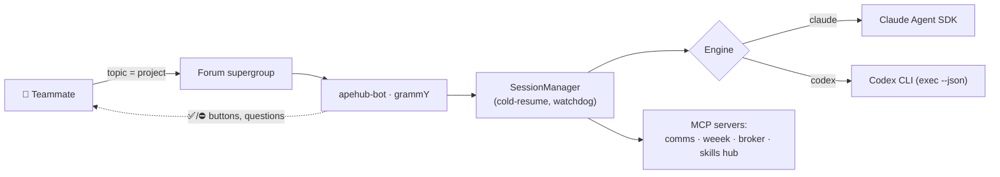

<p align="center">
  
</p>

<h1 align="center">🦍 ApeHub Bot</h1>

<p align="center">
  A per-user Telegram bot for AI coding: one instance per teammate, a forum supergroup
  as the workspace, and <b>every topic = a project</b> with its own AI session.
</p>

<p align="center">
  
  
  
  
  
</p>

---

## What it is

The bot turns a Telegram forum into a console for AI agents. Message a topic and the matching
project's session wakes up (Claude or Codex), works in its own directory, and asks questions or
requests permissions right in the chat via buttons. When idle it sleeps (0 RAM) with its context
saved to disk. One server runs several **isolated** instances — one per person.



## Features

- 🧠 **Two engines, one interface.** `claude` (Claude Agent SDK) and `codex` (ChatGPT/Codex CLI)
  behind a single `Engine` seam. Commands are universal — the bot knows which engine a topic runs.
- 💬 **Nothing blocks on a terminal.** The agent's questions arrive as messages (`ask_user`); tool
  requests arrive as inline ✅/⛔ buttons (`canUseTool`). `/auto` flips on auto-approval.
- 🔑 **Login through the bot** (`/login`), no restart: credentials are read fresh. Subscription
  **or** API key is auto-detected by prefix.
- 🧩 **Skills / plugins hub.** A shared git marketplace is loaded into every session
  (`options.plugins`); `/skills` lists the catalog. Humans add the same repo via `/plugin marketplace add`.
- 📋 **Per-user Weeek.** Projects, boards, columns, tasks, assignees, due dates — all acting as your token.
- 🏗 **Heavy-task broker.** Long jobs (builds, renders) go to a capped queue
  (`systemd-run --user`) so the agent never blocks — `/jobs`.
- 😴 **Warm / cold sessions.** Cold-resume by `session_id`; the watchdog sleeps **only** a truly idle
  turn and never a working agent. Manual `/sleep`.
- 📊 **Accurate context.** A `🧮 58k / 1M (6%) ▰▰▱…` header on every reply, from the same source as
  Claude Code's `/context` (`getContextUsage`). Auto-compaction with a configurable threshold (`/autocompact`).
- 🐙 **Per-user GitHub.** Device-flow login; git operations and commit authorship act as the signed-in user.

## Commands

Shown in Telegram's `/` menu. They act on the current topic's engine.

| Command | What it does |
|---|---|
| `/status` | engine, model, session, context %, autocompact, auto-mode, GitHub/Weeek |
| `/context` | context-window occupancy |
| `/switchmodel [name]` | switch model (no name → picker buttons) |
| `/engine [claude\|codex]` | switch the project's engine |
| `/compact` | compact history: summary → fresh session |
| `/autocompact on\|off\|<tokens>` | auto-compaction and its threshold (e.g. `/autocompact 150k`) |
| `/auto on\|off` | run tools without asking for permission |
| `/skills` | skills available from the marketplace |
| `/jobs` | heavy-task queue (broker) |
| `/new` | start a new session |
| `/sleep` | put the session to sleep manually |
| `/stop` | interrupt the current reply |
| `/login …` | credentials (see below) · `/cancel` aborts input |
| `/help` · `/ping` | help · health check |

## Login (`/login`)

| | What to send |
|---|---|
| `/login claude` | `claude setup-token` (Pro/Max) → `sk-ant-oat…`, or an API key `sk-ant-api…` |
| `/login codex` | contents of `~/.codex/auth.json` (ChatGPT subscription) or an OpenAI API key `sk-…` |
| `/login github` | device flow — sign into your own GitHub; git then acts as you |
| `/login weeek` | token from *workspace → settings → API*; tasks are created as you |

The message carrying a token is deleted right after it's stored; credentials live `0600` in a `0700` dir.

## Engines

| Engine | Status | Backend | Models | Window |
|---|---|---|---|---|
| `claude` | ✅ live | Claude Agent SDK | opus · sonnet · haiku | 1M |
| `codex` | ✅ live | `codex exec --json` + `resume` | gpt-5-codex · gpt-5 · o3 | — |
| `opencode` | 🚧 stub | — | — | — |

## Weeek — agent tools

Available in Claude sessions after `/login weeek`; every action acts as the token owner:

- **Navigate** — `list_projects` · `list_members` · `list_boards` · `list_board_columns` · `list_tags` · `list_tasks` · `list_comments`
- **Create / change** — `create_board` · `create_task` (board/column, assignees, due date, priority, tags, subtask via `parentId`) · `update_task` (assign / re-date / move / priority / tags / custom fields / close) · `complete_task`
- **Collaborate** — `add_comment` (markdown) · `log_time` (minutes)

## Configuration

Via env (`.env` in dev, `~/.config/apehub/bot.env` in prod):

| Variable | Default | Purpose |
|---|---|---|
| `BOT_TOKEN` | — | Telegram bot token (required) |
| `FORUM_CHAT_ID` | — | forum supergroup id (required) |
| `DATA_DIR` | `./data` | sqlite + creds + project working dirs |
| `HUB_DIR` | `/opt/apehub-hub` | clone of the shared skills marketplace |
| `CONTEXT_WINDOW` | `1000000` | model context window for the gauge |
| `SLEEP_AFTER_MS` | `1800000` | idle time before auto-sleep (30 min) |
| `DEFAULT_ENGINE` | `claude` | engine for new projects |
| `GITHUB_CLIENT_ID` | — | OAuth app client id for device flow (public) |
| `MODEL` | — | default model override |

## Run (dev)

```sh
cp .env.example .env     # fill BOT_TOKEN + FORUM_CHAT_ID
bun install
export ANTHROPIC_API_KEY=...   # dev only; prod uses /login or systemd LoadCredential
bun run start
```

## Tests

```sh
bun test           # full suite (engine mocked; no network, no keys)
bun run typecheck  # tsc --noEmit
```

## Architecture (modules)

| File | Responsibility |
|---|---|
| `src/sessions.ts` | per-topic queue, cold-resume, sleep watchdog, auto-compaction, MCP + env assembly |
| `src/engine.ts` + `src/engines/*` | the `Engine` seam and its implementations (claude/codex/stub) |
| `src/commands.ts` · `src/telegram.ts` | universal commands and grammY routing |
| `src/bridge.ts` | permission buttons and `ask_user` |
| `src/login.ts` · `src/github.ts` · `src/config.ts` | credential storage, device flow, env resolution |
| `src/weeek.ts` · `src/hub.ts` · `src/broker.ts` | Weeek MCP, skills marketplace, job broker |
| `src/db.ts` | project state (`bun:sqlite`, auto-migrations) |

## Security

No secrets live in this repo. The bot custodies credentials via `/login` — files `0600` in a `0700`
dir, one Unix user per instance (its own sqlite, creds, working dirs). Agents run as an
**unprivileged** user (no root). In prod the model key arrives via `/login` or systemd
`LoadCredential`, never in the bot's config. Access to a bot = membership of its forum group.
`GITHUB_CLIENT_ID` is public, not a secret.

## Stack

Bun · [grammY](https://grammy.dev) · TypeScript · `bun:sqlite` · `@anthropic-ai/claude-agent-sdk` · Codex CLI
